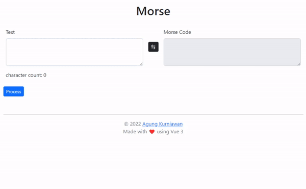

live demo : [morse.agungk.com](https://morse.agungk.com)

Morse code is a method used in telecommunication to encode text characters as standardized sequences of two different signal durations, called dots and dashes, or dits and dahs. Morse code is named after Samuel Morse, one of the inventors of the telegraph. 

read more [wikipedia](https://en.wikipedia.org/wiki/Morse_code)